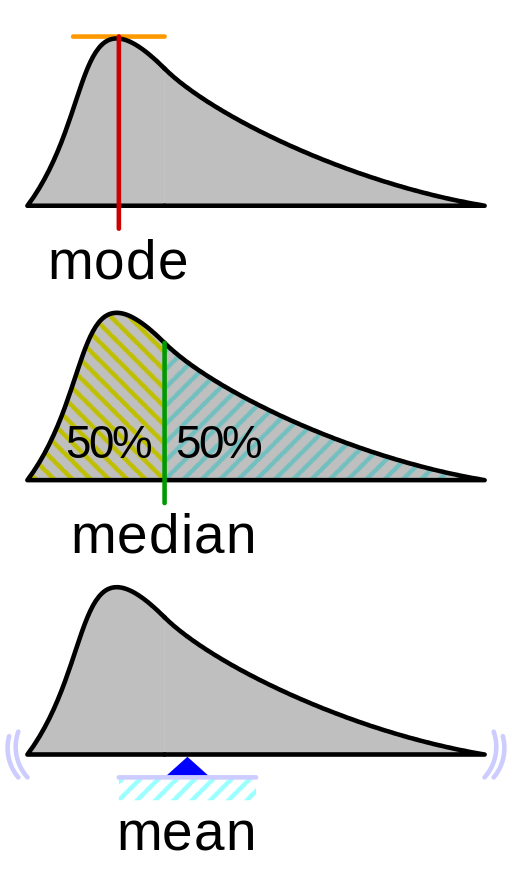
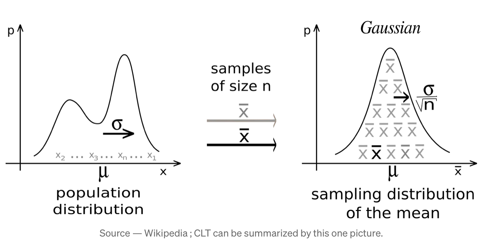
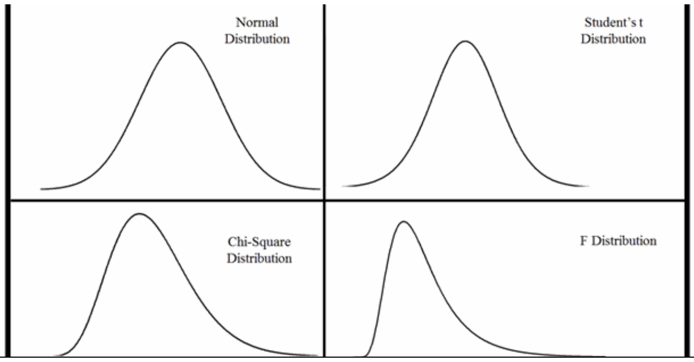

## Overview

Chapter 1 will review important statistical basics that are necessary for later contents. This includes an overview of random variables, basic probability laws, and some distribution theory that forms the bedrock of econometrics. When I studied econometrics for the first time, I found myself a little bit overwhelmed by the quantity of information. Therefore, I have created some supplementary material to the lecture notes to drive key concepts home. Please note that these materials are by no means comprehensive. I have selected (subjectively) some concepts that I initially struggled with. These notes are meant to bolster your **understanding** of certain concepts and may or may not be exam relevant. They are completely separate from Prof. Tartari's notes. 

### The Trio of Summary Statistics

Mean, median, and mode. In your previous statistics education, you will have likely heard of those. You will also likely have learned the precise mathematical definition. I think it is just as important to build visual intuition though. 

 

[Source: StackExchange](https://stats.stackexchange.com/questions/366183/geometric-interpretation-of-mathematical-expectation-of-a-random-variable)

As you can see, the mode is the peak of the distribution. More specifically, the x-coordinate (even more abstract: The point in the sample space) that splits the distribution mass into two equal halfs. The mean is indeed a bit more tricky. 

The mean is a measure of central tendency. Imagine you are balancing the distribution above on a string. The mean is the point where the distribution is in perfect balance, i.e. a weight-balancing point. In Physics, the mean (also called the first moment) is called the center of the mass. This is indeed different from the median in that outliers can drastically affect the mean (and balance point) but not the mean. 

Recall the definition of expectation (continuous case): $\mathbb{E}(X) := \int_{-\infty}^{+\infty} x \cdot f(x)~dx$

### Working with Probabilistic Language (Ex. PSet 1, 1a-d)

What does $\mathbb{E}$ and $\mathbb{P}$ actually mean? In general, we use probabilistic language and tools when we try to make sense of the randomness that occurs within our work. When we draw random samples, we do so to infer information about a larger population with as much confidence as possible. This problem is what is colloquially called "statistical inference" and underpins the entire discipline of statistics. 

Here are a few important notes:

- **A random sample** (PSet 1, 1a): Independently and identically distributed (= "iid") means that our draws are not dependent across each other and are subject to the same data generating process. This is a very important assumption in much of inference. (Fun fact: A lot of modern statistical research--including my own--deals with how inference is possible when the "iid" assumption is violated.)
- **Biasedness** (PSet 1, 1b): An estimated, $\hat{\Theta}$ is an unbiased estimator for the population statistic $\Theta$ iff (if and only if) $\mathbb{E}(\hat{\Theta}) = \mathbb{E}(\Theta)$. What does this mean? We don't have any structural components (i.e. a shifting or scaling term) in the expectation that systematically bias the estimate away from what it should be. 
- **Variance** (PSet 1, 1c): Variance measures the spread of a distribution. Note that we can not only take the variance of a sample, we can also take the variance of existing summary statistics. Observe that $\text{Var}(X)$ is indeed different from $\text{Var}(\mathbb{E}(X))$. How so? (Note: Please do understand why we can take summary statistics of summary statistics. All summary statistics are is a level of summarization/ aggregation of information. As statisticians, a choice of summary statistics can be more or less fitting. We are always just trying to do our best.). 
- **Consistency**: Consistency means that an estimator is (1) unbiased and (2) MSE $\rightarrow 0$ as $n \rightarrow \infty$. In short, we need (1) no systemic bias in the expectation and (2) a convergence that is "good enough" to let our errors go to 0 (We will leave it at this hand-wavy explanation for now). Consistency is an estimator property that is very important and is usually a key part of any discussion around constructing new estimators. As an example: Let us say we are interested in showing that the sample average is consistent: $\lim_{n \rightarrow \infty} \text{Var}(\bar{X}) = \text{Var}(X_i) \cdot \lim_{n \rightarrow \infty} \frac{1}{n} \rightarrow 0$. 

### Some Advice on Proofs 

- Restate the claim (premiss). If you don't do that, you will be prone to forgetting parts of what you want to prove. 
- Collect all the information you know (i.e. do I know that $\mathbb{E}(X) < \infty$? Write it down!)
- Don't assume what you want to prove. This may seem obvious, but often we think about a proof in the reverse direction of what we need to write down. When proving that $\hat{\Theta}$ is unbiased, don't begin your proof with assuming it is unbiased. 
- Work neatly and make notes! If you can't follow your proof and re-understand it a couple days after you did it, I won't either.
- A good strategy when you're completely lost: Write out what you know. For example: Want to prove something about $\mathbb{E}(S^2)$? Well, we know that $S^2 = \frac{1}{n-1} \sum_{i=1}^{n}(X_i - \bar{X})^2$, don't we? Go from there. 

### Limiting Behavior of Sample Means: LLN vs. CLT 

The Law of Large Numbers (LLN) and Central Limit Theorem (CLT) are amongst the most important distributional results in all of statistics. Rather than restating the words and equations you were likely forced to drill into your brain in STAT234/244, I want to take an intuitive and visual approach. 

- **Law of Large Numbers**: As $n \rightarrow \infty$, our sample mean approaches the population mean.
- **Central Limit Theorem**: Regardless of the underlying sampling distribution, if our sample becomes large enough, the means from the random samples (sampling distribution of the mean) will approximate a normal Gaussian distirbution. 

 

### Probability Distributions 

Have you ever looked at the pdf for the normal distribution and thought to yourself "Where do all these $\pi$'s, $\mu$'s, and $\sigma$'s even come from?". Have you ever gotten confused why all these different probability distributions even exist and why? Because same. 

You are looking at a mind map that starts with the derivation of the Gaussian pdf (in a very rudimentary/intuitive sense) and leads into how various important distributions connect to one another and the Gaussian. There are many important distributions missing of course since the Clutter-Clarity trade-off is real! 

 

[Source: Medium.com Article](https://medium.com/analytics-vidhya/law-of-large-numbers-vs-central-limit-theorem-7819f32c67b2)

One thing to take away from this is that the probability distributions that we talk about in class are not "God-given". Statisticians--over centuries--derived them from one another and built a repertoire of various distributions that serve different purposes. As you can see, the normal distribution sits at the literal and figurative center of them all. There is a very good reason for that--and it is related to something called the **Central Limit Theorem**--but we shall postpone this discussion to a later point. If you are interested in learning about how the probability density function for a normal random variable was derived, check out this [great YouTube video by 3b1b.](https://www.youtube.com/watch?v=cy8r7WSuT1I) and [this Medium post](https://medium.com/@curiousincosmos).

### F-,t-, and $\chi^2$-distributions

One thing you may notice in the above visualization is that it doesn't contain the t- and F-distributions (Sorry). These--along with the $\chi^2$ distribution--happen to be extremely important in econometrics. 

Generally, 

- The **t distribution** is commonly used when traditional hypothesis testing, i.e. comparing the means of two samples. Formally, the t-distribution is the distribution of the test statistics that result from this hypothesis test (Thought exercise: Can you see how this relates to the concept of a p-value?). (Note that the t distribution converges in distribution to the **z distirbution** as $\text{df} \rightarrow \infty$. Those two distributions are very closely related). 
- The **F distribution** is used--amongst other things--when comparing two or more means. Analogously, the F distribution characterizes the distribution of F statistics. You may see immediately see how this is could be important in regression analysis with multiple terms.
- The $\chi ^2$ **distribution** is a statistical workhorse and can play multiple roles. It is derived by adding together standard normal RVs and can serve purposes like comparing the relationship between two categorical variables, goodness-of-fit tests, and tests for homogeneity of variances.

[Image source](https://blog.minitab.com/en/statistics-in-the-field/a-field-guide-to-statistical-distributions)

