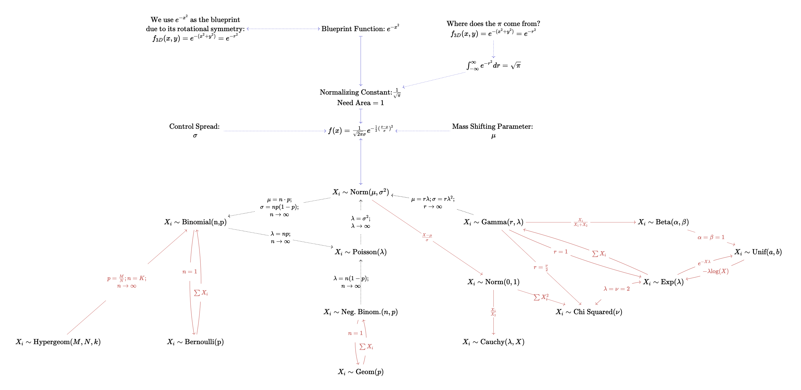

## Overview

Chapter 1 will review important statistical basics that are necessary for later contents. This includes an overview of random variables, basic probability laws, and some distribution theory that forms the bedrock of econometrics. When I studied econometrics for the first time, I found myself a little bit overwhelmed by the quantity of information. Therefore, I have created some supplementary material to the lecture notes to drive key concepts home. Please note that these materials are by no means comprehensive. I have selected (subjectively) some concepts that I initially struggled with. These notes are meant to bolster your **understanding** of certain concepts and may or may not be exam relevant. They are completely separate from Prof. Tartari's notes. 

### Probability Distributions 

Have you ever looked at the pdf for the normal distribution and thought to yourself "Where do all these $\pi$'s, $\mu$'s, and $\sigma$'s even come from?". Have you ever gotten confused why all these different probability distributions even exist and why? Because same. 

You are looking at a mind map that starts with the derivation of the Gaussian pdf (in a very rudimentary/intuitive sense) and leads into how various important distributions connect to one another and the Gaussian. There are many important distributions missing of course since the Clutter-Clarity trade-off is real! 

 

One thing to take away from this is that the probability distributions that we talk about in class are not "God-given". Statisticians--over centuries--derived them from one another and built a repertoire of various distributions that serve different purposes. As you can see, the normal distribution sits at the literal and figurative center of them all. There is a very good reason for that--and it is related to something called the **Central Limit Theorem**--but we shall postpone this discussion to a later point. If you are interested in learning about how the probability density function for a normal random variable was derived, check out this [great YouTube video by 3b1b.](https://www.youtube.com/watch?v=cy8r7WSuT1I) and [this Medium post](https://medium.com/@curiousincosmos).

### F-,t-, and $\chi^2$-distributions

One thing you may notice in the above visualization is that it doesn't contain the t- and F-distributions (Sorry). These--along with the $\chi^2$ distribution--happen to be extremely important in econometrics. 

Generally, 

- The **t distribution** is commonly used when traditional hypothesis testing, i.e. comparing the means of two samples. Formally, the t-distribution is the distribution of the test statistics that result from this hypothesis test (Thought exercise: Can you see how this relates to the concept of a p-value?). (Note that the t distribution converges in distribution to the **z distirbution** as $\text{df} \rightarrow \infty$. Those two distributions are very closely related). 
- The **F distribution** is used--amongst other things--when comparing two or more means. Analogously, the F distribution characterizes the distribution of F statistics. You may see immediately see how this is could be important in regression analysis with multiple terms.
- The $\chi ^2$ **distribution** is a statistical workhorse and can play multiple roles. It is derived by adding together standard normal RVs and can serve purposes like comparing the relationship between two categorical variables, goodness-of-fit tests, and tests for homogeneity of variances.

### Hypothesis Testing

One thing I can only recommend to you is to refamiliarize yourself with the basics of hypothesis testing. 

I found this figure very helpful. Are you able to define what a p-value is from it? 

